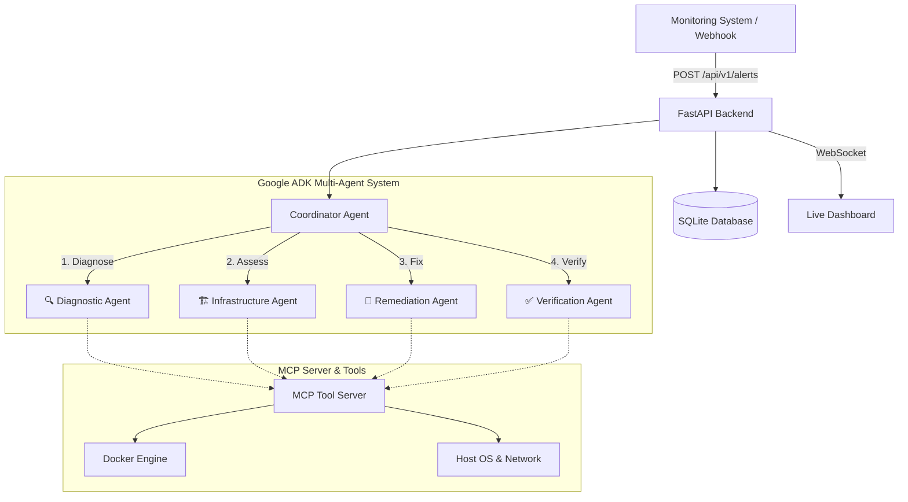

# 🤖 DevOps AI Agents

> **Autonomous multi-agent incident management powered by Google ADK & Gemini**

An AI-driven DevOps system where a swarm of specialized agents automatically diagnoses, remediates, and verifies infrastructure incidents — reducing mean time to recovery (MTTR) from hours to seconds.

---

## 🎯 Problem

DevOps and SRE teams are drowning in **alert fatigue**. When a monitoring system fires an alert, on-call engineers must manually:

1. Pull logs and inspect containers
2. Guess the root cause
3. Apply a fix
4. Verify the system is healthy

This manual triage delays recovery and burns out engineers.

## 💡 Solution

**DevOps AI Agents** introduces a fully autonomous, multi-agent AI system that sits between your monitoring stack and your infrastructure. When an alert arrives via webhook, a swarm of 5 specialized agents springs into action — completely eliminating human intervention for common incidents.

---

## 🏗️ Architecture



---

## 🤖 AI Agents & Their Roles

| # | Agent | Role | Key Tools |
|---|-------|------|-----------|
| 1 | **Coordinator Agent** | Root orchestrator — manages the incident lifecycle and delegates tasks in sequence | Sub-agent delegation |
| 2 | **Diagnostic Agent** | Log analyst — reads Docker logs, lists containers, identifies root causes (OOMKilled, Exit Code 1, Port Conflicts) | `list_containers`, `get_container_logs` |
| 3 | **Infrastructure Agent** | System inspector — monitors CPU, memory, disk, and network to assess blast radius | `get_cpu_usage`, `get_memory_usage`, `get_disk_usage`, `get_container_stats` |
| 4 | **Remediation Agent** | Executor — applies fixes (restart containers, prune Docker, run safe shell commands) gated by `DRY_RUN` mode | `restart_container`, `execute_safe_command`, `prune_docker_system` |
| 5 | **Verification Agent** | Validator — runs post-fix health checks and generates a final pass/fail determination | `http_health_check`, `check_port_open`, `list_containers` |

---

## 🔑 Key Concepts Demonstrated

| Concept | Where |
|---------|-------|
| **Multi-Agent System (Google ADK)** | `agents/` — 5 LlmAgents with tool-use and sub-agent delegation |
| **MCP Server** | `mcp_server.py` — 12 tools exposed via Model Context Protocol |
| **Security Features** | Webhook `X-Webhook-Secret` auth, command blocklist, `DRY_RUN` mode |
| **Deployability (Docker)** | `Dockerfile` + `docker-compose.yml` for one-command deployment |
| **Live Dashboard** | WebSocket-powered real-time agent activity feed |

---

## 🚀 Quick Start

### Prerequisites

- Python 3.11+
- Docker (for container management tools)
- A [Google AI Studio](https://aistudio.google.com/) API key

### Installation

```bash
# Clone the repository
git clone https://github.com/Aman-khare/Devops-AI-Agents.git
cd Devops-AI-Agents

# Create virtual environment
python -m venv .venv

# Activate (Windows)
.\.venv\Scripts\Activate.ps1
# Activate (macOS/Linux)
# source .venv/bin/activate

# Install dependencies
pip install -r requirements.txt

# Configure environment
cp .env.example .env
# Edit .env and add your GOOGLE_API_KEY
```

### Run

```bash
uvicorn main:app --reload --port 8000
```

Open the dashboard at **http://localhost:8000**

---

## 🐳 Docker Deployment

```bash
docker-compose up --build -d
```

The container mounts the host's Docker socket so agents can interact with your actual infrastructure.

---

## 🔌 MCP Server

The agent tools are also exposed via a standard **Model Context Protocol (MCP)** server, allowing any MCP-compatible client (Claude Desktop, Cursor, etc.) to use them.

```bash
mcp run mcp_server.py        # stdio mode
mcp dev mcp_server.py        # dev inspector
```

### Available MCP Tools (12 total)

| Category | Tools |
|----------|-------|
| **Docker** | `list_containers`, `get_container_logs`, `restart_container`, `get_container_stats`, `prune_docker_system`, `get_docker_images` |
| **System** | `get_disk_usage`, `get_memory_usage`, `get_cpu_usage` |
| **Network** | `http_health_check`, `check_port_open` |
| **Execution** | `execute_safe_command` (sandboxed with blocklist) |

---

## 🔒 Security

- **Webhook Authentication**: All alert endpoints are protected by `X-Webhook-Secret` header validation.
- **Command Blocklist**: Dangerous commands (`rm -rf /`, `DROP DATABASE`, `shutdown`, fork bombs, etc.) are blocked at the tool level.
- **DRY_RUN Mode**: When `DRY_RUN=true` (default), all destructive operations are simulated — no actual changes are made.
- **Timeout Protection**: All shell commands have a configurable timeout (default: 30s) to prevent runaway processes.

---

## 🧪 Testing

```bash
python -m pytest -v
```

Tests run with a temporary SQLite database, `DRY_RUN=true`, and the agent pipeline disabled.

```
26 passed in ~30s
```

---

## ⚡ Test an Alert

```bash
# Simulate via the built-in endpoint
curl -X POST http://localhost:8000/api/v1/alerts/simulate

# Or send a real alert
curl -X POST http://localhost:8000/api/v1/alerts \
  -H "Content-Type: application/json" \
  -H "X-Webhook-Secret: your_webhook_secret_here" \
  -d '{"alert_type":"container_crash","container_id":"abc123","service":"web-app","message":"OOMKilled","severity":"critical"}'
```

---

## 📁 Project Structure

```
devops-ai-agents/
├── agents/                  # Google ADK Agent definitions
│   ├── coordinator.py       #   Root orchestrator agent
│   ├── diagnostic.py        #   Log analysis agent
│   ├── infrastructure.py    #   System health agent
│   ├── remediation.py       #   Fix execution agent
│   └── verification.py      #   Post-fix validation agent
├── api/                     # FastAPI route handlers
│   ├── alerts.py            #   Alert ingestion + agent pipeline
│   ├── incidents.py         #   Incident CRUD endpoints
│   └── websocket.py         #   Real-time dashboard updates
├── models/                  # Data models & database
│   ├── alert.py             #   Pydantic alert schema
│   ├── incident.py          #   Incident & trace models
│   └── database.py          #   SQLite async database layer
├── tools/                   # ADK tool functions (also used by MCP)
│   ├── docker_tools.py      #   Docker container management
│   ├── system_tools.py      #   CPU, memory, disk monitoring
│   ├── network_tools.py     #   HTTP health checks, port scans
│   └── command_runner.py    #   Sandboxed command execution
├── templates/               # Jinja2 HTML templates
├── static/                  # CSS & JS assets
├── tests/                   # Pytest test suite (26 tests)
├── mcp_server.py            # MCP Server (12 tools)
├── main.py                  # FastAPI application entry point
├── Dockerfile               # Production container image
├── docker-compose.yml       # One-command deployment
├── requirements.txt         # Python dependencies
└── .env.example             # Environment variable template
```

---

## 📡 API Endpoints

| Method | Endpoint | Description |
|--------|----------|-------------|
| `GET` | `/` | Dashboard UI |
| `GET` | `/health` | Readiness check |
| `POST` | `/api/v1/alerts` | Receive an alert (webhook) |
| `POST` | `/api/v1/alerts/simulate` | Create a sample incident |
| `GET` | `/api/v1/incidents` | List all incidents |
| `GET` | `/api/v1/incidents/{id}` | Incident detail |
| `WS` | `/ws/incidents` | Live dashboard updates |

---

## ⚙️ Configuration

| Variable | Default | Description |
|----------|---------|-------------|
| `GOOGLE_API_KEY` | *(required)* | Google AI Studio API key for Gemini |
| `DRY_RUN` | `true` | Simulate destructive operations |
| `WEBHOOK_SECRET` | *(empty)* | Webhook auth secret (empty = open) |
| `APP_ENV` | `development` | Application environment |
| `LOG_LEVEL` | `INFO` | Logging verbosity |
| `CORS_ORIGINS` | `*` | Allowed CORS origins |

---

## 📄 License

MIT